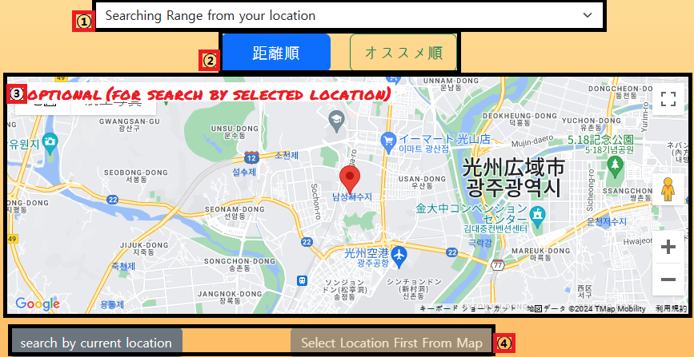
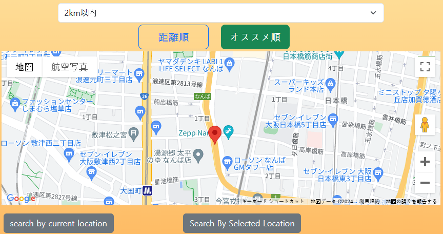
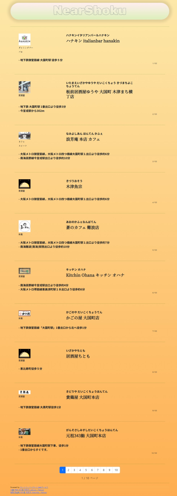
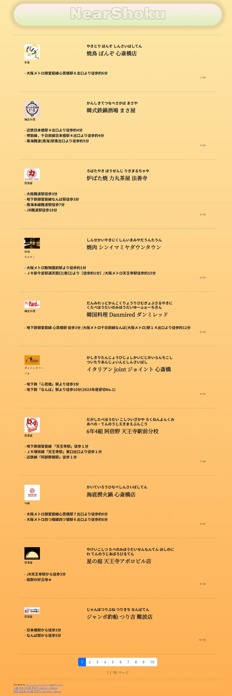
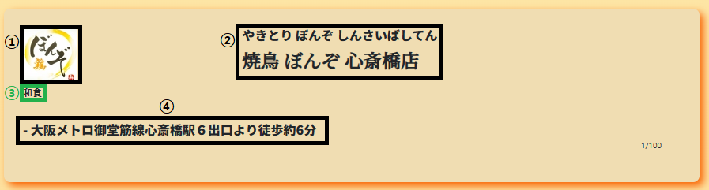
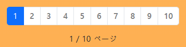
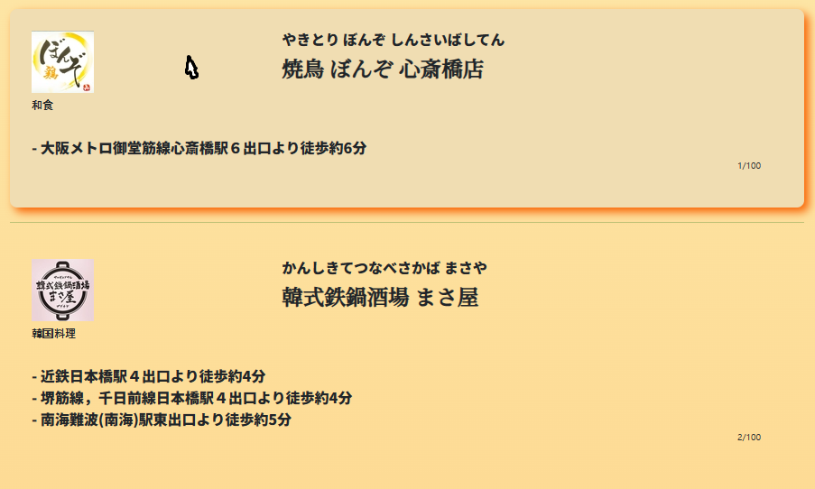
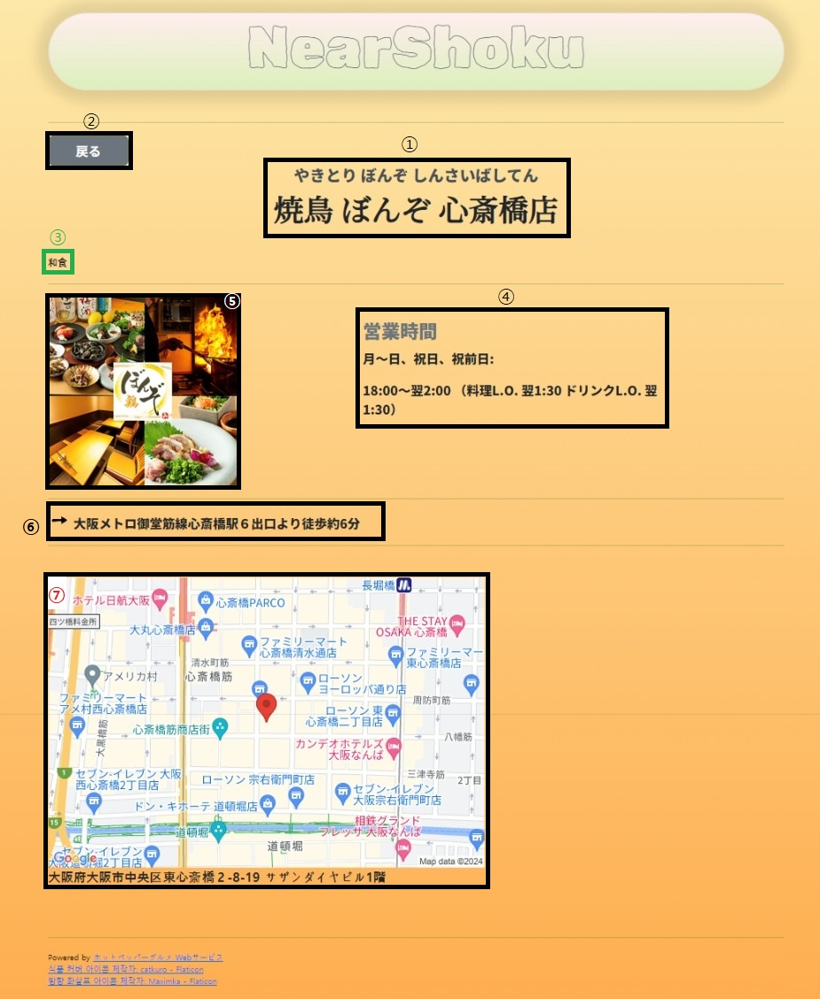

[English](#eng_top) | [日本語](#jp_top)

---

<!-- PROJECT LOGO -->
 

  

<h3 align="center">NearShoku - ニア食</h3>

  

    <!--project description-->
    NearShoku - ニア食 is a web application that helps you 
    find restaurants near your selected location (or current) based on the cafeteria you set.
         
    It utilizes
     
    the Geolocation to fetch your current location
     
    GoogleMaps API to fetch you selected location
     
    Recruit-HotpepperAPI to search for nearby restaurant information
     
  

<!-- ABOUT THE PROJECT -->
## About The Project

The goal of this project is to facilitate users in easily finding and selecting various restaurants near their current location. 
Through NearShoku, users can conveniently decide on dining locations and explore different restaurants to discover new flavors.

(<a href="#eng_top">back to top</a>)

### Built With

(<a href="#eng_top">back to top</a>)

<!-- Usage example -->
# Usage NearShoku

<!-- index EXAMPLES -->
## index Page
### ※ It works only in Japan

① Select search Range : [ 300m ~ 3KM ] (Default is 300m)
 
② Select Order :
Search by Distance / 
Search by Recommended
 
③ Select Location : If you want to choose location you can!
 
④ Submit !
 

ⓐ When you select a location, the button is activated
 
 

 
ⓑExample

Range: 2km 
Order: Search by Recommended 
Location: Osaka-Namba

  
    ⓒOrder Difference
  

 

(<a href="#eng_top">back to top</a>)

<!-- result EXAMPLES -->
## Result Page

- Shop Info  
①Shop thumbnail  
②Shop Name  
③Shop Genre 
④Shop Access 
⑤Select page 

    

        
        ⓐ shop box
        
    

Shop boxes are clickable
It linked to shop detail information

(<a href="#eng_top">back to top</a>)

<!-- detail EXAMPLES -->
## Detail Page
If you click the shop box, you can show shop detail.

- Shop Info  
① Shop Name  
② Return  

③ Shop Genre  

④ Shop Open time  
⑤ Shop Thumbnails 
⑥ Shop Access  

   ⑦ Shop Location & Address  

(<a href="#eng_top">back to top</a>)

<!-- CONTACT -->
## Contact

Jeong JaeHoon - sagvd01@gmail.com

Project Link: [https://github.com/op6161/nearshoku-project](https://github.com/op6161/nearshoku-project)

(<a href="#eng_top">back to top</a>)

---

[English](#eng_top) | [日本語](#jp_top)

---

<!-- PROJECT LOGO -->
 

  

<h3 align="center">NearShoku - ニア食</h3>

  

    <!--プロジェクトの説明-->
    NearShoku - ニア食は、設定した条件に基づいて、選択した場所（または現在の場所）の近くのレストランを見つけるためのウェブアプリケーションです。
         
    使用されるもの
     
    Geolocationを使用して現在の位置を取得する
     
    GoogleMaps APIを使用して選択した位置を取得する
     
    近くのレストラン情報を検索するためのRecruit-HotpepperAPI
     
  

<!-- ABOUT THE PROJECT -->
## プロジェクトについて

このプロジェクトの目的は、ユーザーが現在地の近くにあるさまざまなレストランを簡単に見つけて選択できるようにすることです 。
NearShokuを通じて、ユーザーは便利に食事の場所を決め、さまざまなレストランを探索して新しい味を見つけることができます。

(<a href="#jp_top">トップへ戻る</a>)

### 使用技術

(<a href="#jp_top">トップへ戻る</a>)

<!-- 使用例 -->
# 使用方法 NearShoku

<!-- index 例 -->
## indexページ
### ※日本国内のみ機能します

① 検索範囲を選択 : [ 300m ~ 3KM ]（デフォルトは300m）
 
② 順番を選択 :
距離順で検索 / 
おすすめ順で検索
 
③ 位置を選択 : 位置を選ぶこともできます！
 
④ 提出 !
 

ⓐ 位置を選択すると、ボタンがアクティブになります
 
 

 
ⓑ例

範囲: 2km 
順番: おすすめ順で検索 
位置: 大阪難波

  
    ⓒ順番の違い
  

 

(<a href="#jp_top">トップへ戻る</a>)

<!-- result 例 -->
## 結果ページ

- お店情報  
① お店サムネイル  
② お店名  
③ お店ジャンル 
④ お店アクセス 
⑤ ページを選択 

    

        
        ⓐ お店ボックス
        
    

お店ボックスをクリックすると、お店の詳細情報にリンクされます

(<a href="#jp_top">トップへ戻る</a>)

<!-- 詳細ページの例 -->
## 詳細ページ
お店ボックスをクリックすると、お店の詳細が表示されます。

- お店情報  
① お店名  
② 戻る  

③ お店ジャンル  

④ お店の営業時間  
⑤ お店のサムネイル 
⑥ お店アクセス  

   ⑦ お店の場所と住所  

(<a href="#jp_top">トップへ戻る</a>)

<!-- お問い合わせ -->
## お問い合わせ

Jeong JaeHoon - sagvd01@gmail.com

プロジェクトリンク: [https://github.com/op6161/nearshoku-project](https://github.com/op6161/nearshoku-project)

(<a href="#jp_top">トップへ戻る</a>)

---

[English](#eng_top) | [日本語](#jp_top)